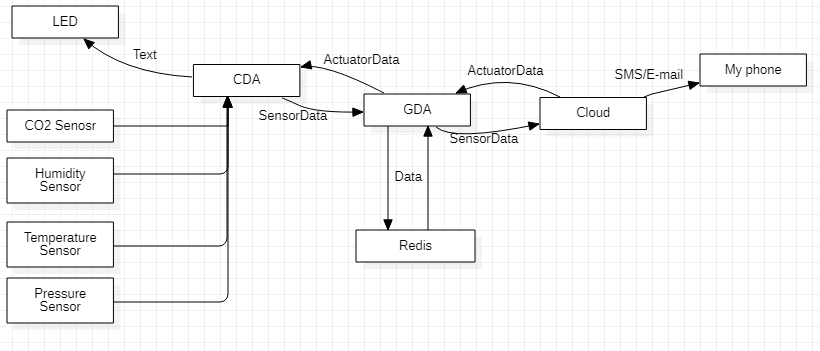
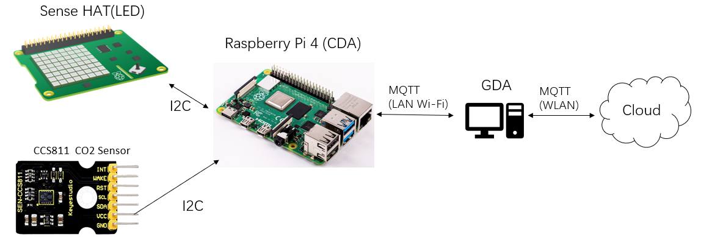
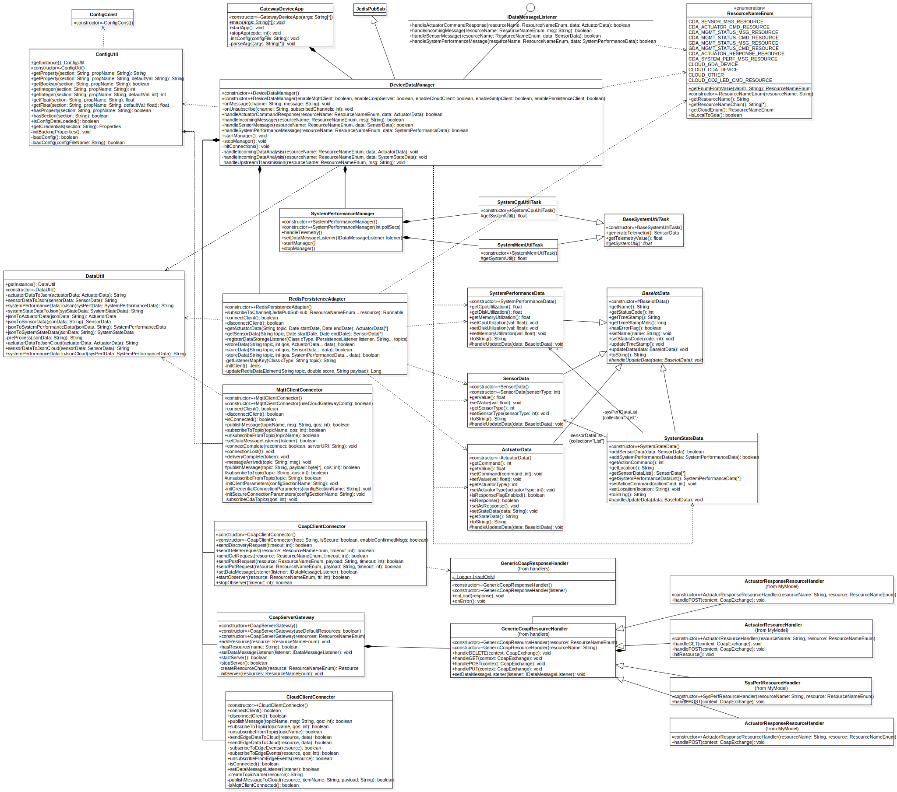
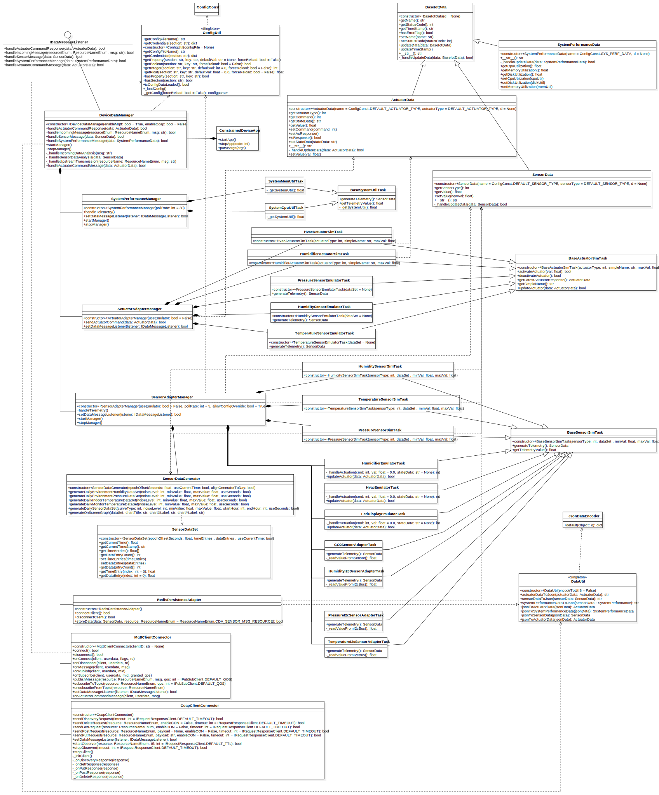
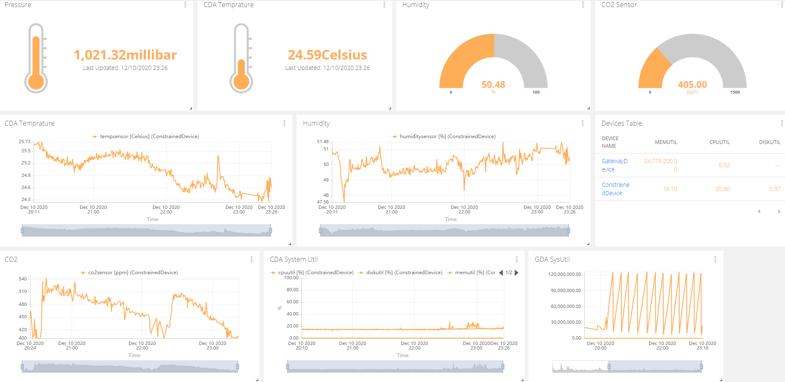

# Connected Devices - Semester Project Summary

Lab Module 12 - Semester Project

## Description

## What - The Problem 

**What problem are you trying to solve and why does it matter?**

The problem I want to solve in this project is to detect CO2 level indoor.

This quite matters our life, because according to some research, when the CO2 level beyand about 1000 ppm, people will feel sleepy. This is a very common thing which will be happen in some closed meeting place or our personal work room. Especially at time now, a lot of people are working from home. They should maintain their work place environment so as to keep high work efficiency and life quality.

## Why - Who Cares? 

**Why do you care about this particular problem?**

It's a very common case that every person may meet, and usually little people realise that sometimes why they feel sleepy and tired is because of the CO2 level in their room. And such product that can detect C02 level in any closed env, show and alert info of C02 level can help improve their work or study environment.

## How - Actual Technical Approach

### Some general Diagrams

Here is the general structure diagram(CO2 sensor related part)of my approach:



Here is the simple diagram of how hardwares are connected to each other:



### CO2 Sensor

In detail, I add a new class `CO2SensorAdapterTask` to get telemetry by using CCS811 CO2 Gas quality sensor. The function is implemented by using [Adafruit_CircuitPython_CCS811](https://github.com/adafruit/Adafruit_CircuitPython_CCS811) library which is using I2C bus to communicate on address 0x5A.

### LED

At current, I am using the LED on the [SenseHAT](https://www.raspberrypi.org/products/sense-hat/) to scroll test, which is defined as Actuator and where ActuatorData is executed on(Show notification text). To keep convenient, I use [pisense](https://pisense.readthedocs.io/en/latest/) library to control the [SenseHAT](https://www.raspberrypi.org/products/sense-hat/).

In code, the LED Display logic exist in `LedDisplayEmulatorTask`. And for emulating, LED is being used to show command in `HumidifierEmulatorTask` and `HvacEmulatorTask`.

### System Diagram

In this part, I will show you the class diagram of current implementation of software including CDA and GDA.

#### Class Diagram of GDA



#### Class Diagram of CDA



### What THREE (3) sensors and ONE (1) actuator did you leverage (add more if you wish)?

- CDA Sensor 1: CO2 Sensor
  
  Use CCS811 to collect data from real world from 400 - 8192 ppm.

- CDA Sensor 2: Temperature Sensor
  
  Use both temperature sensor in HTS221 and LPS25H on SenseHAT. Use the average value of two source.

- CDA Sensor 3: Humidity Sensor

  HTS221 on SenseHAT, collect data from real world from 0 - 100% relative humidity.

- CDA Sensor 4: Pressure Sensor

  LPS25H on SenseHAT, collect data from real world from 260 - 1260 millibar.

- CDA Sensor 5: SystemPerformance Sensors

  Get System performance by using python library `psutil`.

- CDA Actuator 1: LED

  A LED2472G connected via an Atmel ATTINY88 communicating via i2c at address 0x46 with the Pi

- GDA Sensor 1: SystemPerformance Sensors

  Get System performance by using java package `java.lang.management`.

### What ONE (1) CDA protocol and THREE (3) GDA protocols did you implement (add more if you wish)?

- CDA Protocol 1: MQTT
  
  For upstream SensorData and receive Actuator Data.

- GDA Protocol 1: MQTT

  For send Actuator and receive SensorData Data with GDA.

  For upstream SensorData and receive ActuatorData with Cloud(Ubidots).

- GDA Protocol 2: CoAP

  For send Actuator and receive SensorData Data with GDA.

- GDA Protocol 3: SMTP (TODO)
- GDA Protocol 3: HTTP (TODO)
 
### What TWO (2) cloud services / capabilities did you use (add more if you wish)?

- Cloud Service 1 (ingress):
  
  Use [Ubidots](https://ubidots.com/) MQTT broker to receive message from GDA.
  
  Use [Ubidots](https://ubidots.com/) native service to automatically store all received data.
  
  Use [Ubidots](https://ubidots.com/) native service to visualize sensor data.

- Cloud Service 2 (egress): MQTT
  
  Use [Ubidots](https://ubidots.com/) Event to send cmd to GDA, also send SMS or E-mail to my moblie phone.
 
## Results - Actual Outcomes and Visualization Screen Shot(s)

### Outcomes Achieved

**In summary:**

1. I deployed the CDA software on my Raspberry Pi 4.
2. I could see current CO2 level number on SenseHAT LED screen.
3. I could see the history of all sensor data on Ubidots Dashboard.
4. If humidity, temperature is out of pre-config normal range, I could see notification on the SenseHat LED screen.
5. If CO2 Level is out of normal range, I could see notification on the SenseHat LED screen and receive SMS form Ubidots.


### Screen Shots Representing Visualized Data

Following picture may be hard to recognize, you may open them in a new page to take a careful look.

1. CO2 out of range(now is CO2), Cloud -> GDA -> CDA

    

2. CO2 out of range(now is CO2), CDA -> LED Screen

    

3. Data history on Ubidots Dashboard

    

4. Human Breath CO2

    [Human Breath CO2](https://drive.google.com/file/d/1ObqHhH2Kwtla6XKCCx44ggRAuiOScPDP/view?usp=sharing)

5. Full demo

    [Full demo](https://drive.google.com/file/d/1l3XqyFa8WWp5Rg-gJpOXu9PODotDBt0L/view?usp=sharing)


## Summary of some tricky problem resolved

### CCS811

Read chip datasheet carefully, this chip need 5V power but not 3.3 power which Raspberry Pi provides.

If using drive from **Adafruit**, do not using their deprecated library, such as `Adafruit Python GPIO` or `Adafruit CCS811`, but use their **CircuitPython** library.

When coding, let program wait for a short time after instantiate the I2C instance in order to  guarantee the I2C instance has been fully initialized.

```python
i2c_bus = busio.I2C(SCL, SDA)
sleep(few_seconds)
ccs =  adafruit_ccs811.CCS811(i2c_bus)
```

### Redis

Redis does not maintain the connection when it's idle after a read/write operation. So sometimes, redis may operate on a broken connection which throws a ConnectionException.

So you have to explicitly set the connection timeout for each Jedis instance(IF using Jedis):
```
Jedis(host,port,a_high_timeout)
```

Also, this cannot ensure the problem won't occur again, so you may add  try/catch surrounding any read/write operation to fully resolve such problems.


## Future

### SMTP client

Add SMTP client to send notification e-mail to user.

### CoAP server

Perfect CoAP server for transmission between CAD and GDA. 

### CI/CD

1. Perfect the `GitHub Action` for online VCS.
2. Setup Jenkins for CDA on Raspberry Pi.
3. Add code packaging.

### More cloud service support

1. Add support for more cloud service:
   1. AWS
   2. Azure
   3. GCP

### Perfect comments and docs

1. Perfect comments everywhere.
2. Add a feature to generate docs.